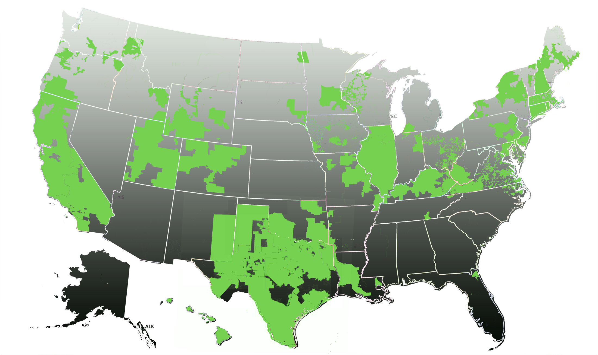

<h2>Federal Agency - Frequently Asked Questions</h2>
The following are frequently asked questions regarding Green Button use within Federal Agencies. If you do not see our question below, please:
<a class="buttonish" href="mailto:info@greenbuttondata.org?subject=Federal%20FAQ%20Request&#038;body=Hi!%0A%0AI’d%20like%20to%20get%20an%20answer%20to%20the%20following%20Green%20Button%20question.%20Please%20send%20me%02%20information?%0A%0AThanks,%0A%0A[Your%20name]%0A[Your%20organization]%0A[Your%20contact%20information]%0[Enter%20Your%20Question%20Here.]">Send us your question.</a>

<dl>
<dt>How do I find out if my utility supports Green Button Connect My Data?</dt>
<dd>A list of utilities that currently support Green Button may be <a href="http://www.greenbuttondata.org/">found here.</a> 
Don't see your utility?  <a class="buttonish" href="mailto:info@greenbuttondata.org?subject=Getting%20started%20with%20Green%20Button&#038;body=Hi!%0A%0AI’d%20like%20to%20get%20started%20with%20Green%20Button.%20Could%20you%20send%20me%20more%20information?%0A%0AThanks,%0A%0A[Your%20name]%0A[Your%20organization]%0A[Your%20contact%20information]">Request Utility Green Button Information.</a> </dd>

<dt>Is a Smart (AMI) meter required for Green Button Support?</dt>
<dd>An Advanced Metering Infrastructure (AMI) meter is not required for Green Button data, but is the most common meter used for Green Button Connect My Data deployments. Keep in mind that Green Button data does not normally come directly from the meter itself. Green Button data normally comes from your utility's Meter Data Management (MDM) system or a utility maintained data warehouse. Some utilities are supporting Green Button data on a monthly cycle using old style meters. Larger facilities are supporting Green Button data from energy management platforms within the building.</dd>

<dt>How do I determine when in Facility Metering is justified?</dt>
<dd>This is generally a cost trade off with respect to the size of the utility and it's operating characteristics. Larger, more modern or more complex facilities may justify the cost of an energy management platform with sub-meters within the facility itself. In this case, make sure your facilities energy management platform support Green Button Connect My Data.  Smaller facilities, or those with minimal operational footprint, may be cost effectively included into your agency energy management strategy by using the utilities Green Button services. In most cases, there is no cost for the utility Green Button data. In either case, your portfolio energy management system can use both sources.</dd>

<dt>Is there a roadmap for agency support of Green Button in their energy management processes?</dt>
<dd>Each agency is encouraged to develop and energy management roadmap that is consistent with their mission and goals. The overall industry roadmap for Green Button deployment may serve to guide you in development of this roadmap. In general, 2015 is going to be the year of Green Button Connect My Data roll-out in major electricity markets.</dd>

<dt>Are agencies to be provided information as to vendors whose products and services support Green Button?</dt>
<dd>The web site <a href="http://www.greenbuttondata.org/">greenbuttondata.org</a> will be consistently maintained to keep all new information concerning vendor and services support of Green Button. In addition, a industry certification process is being initiated where you will be able to find certified Green Button Connect My Data and Download My Data vendors. </dd>

<dt>Do agencies have a sense as to how many of their facilities are in services areas of utilities that support Green Button?</dt>
<dd>The following map will be kept current so that you may get a general feeling as to service areas that support Green Button. Note that in the following, Green Button Download My Data is depicted. As Connect My Data deployments begin nationally in 4Q2014, this map will be updated. 

</dd>

<dt>What authority do agency managers have to initiate Green Button energy management activities?</dt>
<dd>Guidance for all agencies is to be provided from the Federal Energy Management Program (FEMP) by October of 2014.</dd>

<dt>How are larger facilities such as campuses or bases to approach the Green Button opportunity</dt>
<dd>Green Button may be made available from building meters, sub-meters within buildings, area meters, or whole campus meters. It is up to the needs of the energy managers to determine where it is most applicable for a given site.  Green Button provides a means by which facilities energy managers might deploy interoperable energy management platforms. The composition of data received from the various portions of the deployment that may be related to the benchmarking and management needs of that facility, or a portfolio of such facilities opportunity, will define how the meter data is to flow. Green Button provides the means by which these needs might be met.</dd>

</dl>

